# 📊 Proiect Data Analysis

## 🎯 Introducere

  Acest proiect reprezintă un dashboard interactiv în Excel, care analizează rezultatele Evaluării Naționale din România din 2025. Acesta utilizează vizualizări dinamice pentru a explora performanța la nivel regional, distribuția notelor și rezultatele contestațiilor.

Proiectul evidențiază abilitățile mele de analiză a datelor și de utilizare a Excelului, folosind un set de date care conține peste 150.000 de înregistrări din cadrul Evaluării Naționale 2025. Pe parcursul proiectului, am calculat indicatori statistici descriptivi (media, mediana, quartilele și abaterea standard) pentru a analiza performanța elevilor și am prezentat rezultatele printr-o varietate de grafice interactive.

Ca abordare complementară, am utilizat și SQL pentru a calcula și analiza aceiași indicatori principali, validând astfel rezultatele obținute în Excel.


  Proiectul demonstrează, de asemenea, capacitatea mea de a:

- Crea liste derulante dinamice folosind validarea datelor;
- Construi și personaliza tabele Pivot și grafice Pivot;
- Conecta mai multe tabele Pivot la același slicer pentru filtrare sincronizată;
- Proiecta dashboard-uri interactive;
- Utiliza SQL.


## 🚀 Cum functionează?
### 📈 Primul Dashboard
  Selectează un județ din meniul drop-down.

  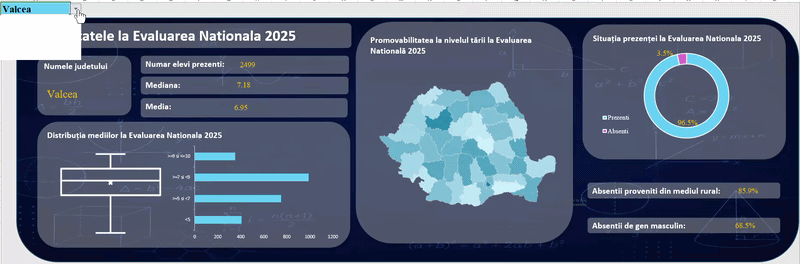


### 📈 Al doilea Dashboard
  Selectează o regiune din slicer.

  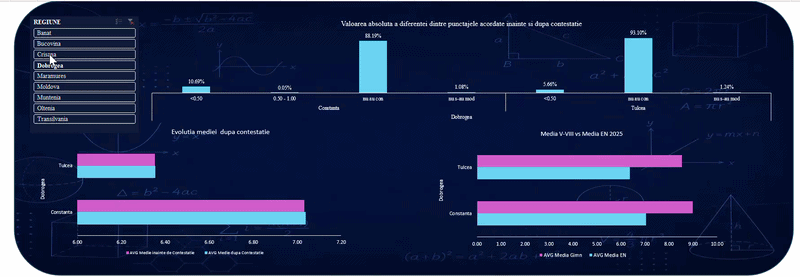

## 💡 De ce am realizat acest proiect?

Acesta este primul meu proiect de analiză a datelor și reprezintă o combinație între pasiunea mea pentru educație și interesul meu pentru domeniul data analytics. Având șase ani de experiență ca profesor de matematică, mi-am dorit să explorez modul în care datele educaționale pot fi analizate pentru a identifica tendințe, compara rezultate și răspunde unor întrebări relevante, dincolo de simpla prezentare a unor statistici.


Proiectul se focusează pe următoarele întrebări:
- **Este evaluarea cu adevărat obiectivă?**

   _Răspuns:_ Nu. 9% dintre participanții la examen au depus contestație, iar în 92% dintre cazuri media finală s-a modificat
  
  ```sql
  SELECT
    numar_contestatii *100/numar_elevi AS procent_contestatii,
    numar_modificari *100/numar_contestatii AS procent_modificari
  FROM (
    SELECT
        COUNT(rezultate_en.cod_unic_candidat) FILTER ( WHERE
            rezultate_en.contestatie_romana = 'DA' OR
            rezultate_en.contestatie_matematica = 'DA'
        ) AS numar_contestatii,
        COUNT(rezultate_en.cod_unic_candidat) AS numar_elevi,
        COUNT(rezultate_en.cod_unic_candidat) FILTER ( WHERE
            rezultate_en.nota_romana <> rezultate_en.nota_finala_romana
            OR
            rezultate_en.nota_matematica <> rezultate_en.NOTA_FINALA_MATEMATICA
        ) AS numar_modificari
    FROM
        rezultate_en
        LEFT JOIN
        counties ON
        rezultate_en.cod_judet = counties.county_code
    );
  ```

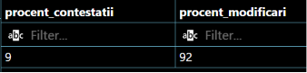

 Acest rezultat poate fi observat și în graficul de mai jos:

 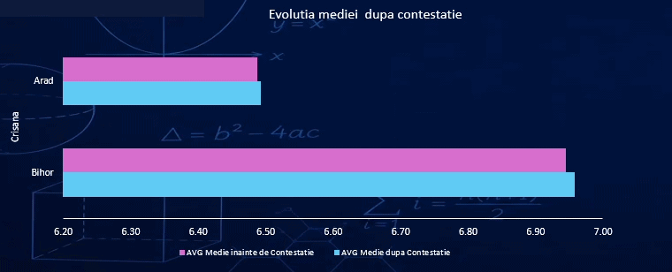 
  
- **Poate un mediu social nefavorabil să contribuie la absenteismul și abandonul școlar?**
  
  _Răspuns:_ Da. Pe baza datelor înregistrate, în fiecare județ, cel mai mare număr de elevi absenți provine din mediul rural.

```sql
  SELECT
    numar_absenti *100/numar_elevi AS procent_absenti,
    absenti_rural *100/numar_absenti AS procent_rural
FROM (
    SELECT
        COUNT(rezultate_en.cod_unic_candidat) FILTER ( WHERE
            rezultate_en.STATUS_ROMANA = 'ABSENT' OR
            rezultate_en.STATUS_MATEMATICA = 'ABSENT'
        ) AS numar_absenti,
        COUNT(rezultate_en.cod_unic_candidat) AS numar_elevi,
        COUNT(rezultate_en.cod_unic_candidat) FILTER ( WHERE
            rezultate_en.MEDIU = 'RURAL' AND
            (rezultate_en.STATUS_ROMANA = 'ABSENT' OR
            rezultate_en.STATUS_MATEMATICA = 'ABSENT')
        ) AS absenti_rural
    FROM
        rezultate_en
        LEFT JOIN
        counties ON
        rezultate_en.cod_judet = counties.county_code
    );
```

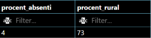

  Acest rezultat este reflectat și în graficul și statisticile de mai jos.
  
  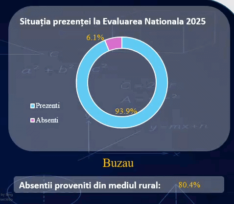
  
- **Sunt notele școlare în concordanță cu rezultatele obținute la Evaluarea Națională?**
  
  _Răspuns:_ Nu. Datele analizate arată că media finală obținută pe parcursul anilor de școală este mai mare decât media obținută la examenul de Evaluare Națională.

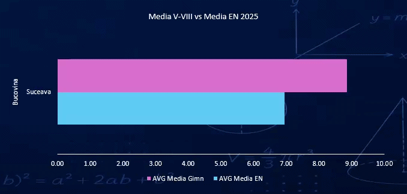

 Următoarea secțiune evidențiază cele mai mari 10 diferențe identificate între cele două medii.

  ```sql
    SELECT
    elev,
    judet,
    medie_gimnaziu - medie_examen AS diferenta_medie
FROM (
    SELECT
        counties.county_name AS judet,
        rezultate_en.cod_unic_candidat AS elev,
        rezultate_en.media AS medie_examen,
        rezultate_en.MEDIA_GIMNAZIU AS medie_gimnaziu
    FROM
        rezultate_en 
        LEFT JOIN
        counties
        ON
        rezultate_en.cod_judet = counties.county_code
    WHERE
        rezultate_en.media IS NOT NULL
    
)
ORDER BY diferenta_medie DESC
LIMIT 10;
  ```

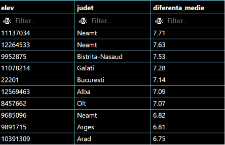
  
- **Există diferențe regionale semnificative în ceea ce privește rezultatele la evaluarea națională?**
  
  _Răspuns:_ Da. Graficul privind distribuția notelor pe județe, precum și graficul privind rata de promovabilitate pentru fiecare județ, evidențiază diferențe semnificative în ceea ce privește performanța școlară între județe.

  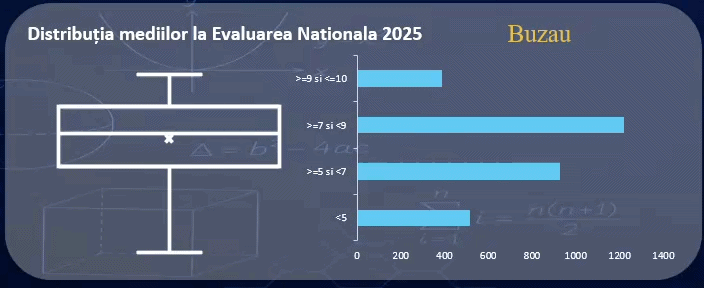

  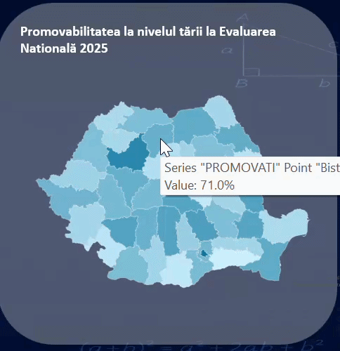

  Top 10 județe privind rata de promovabilitate

  ```sql
    SELECT
    county_name AS judet,
    ROUND(nr_elevi_promovati*100.0/nr_elevi_inscrisi,2) AS procent_promovabilitate
  FROM (
    SELECT 
        counties.county_name,
        COUNT(rezultate_en.cod_unic_candidat) AS nr_elevi_inscrisi,
        COUNT(rezultate_en.cod_unic_candidat) FILTER(
            WHERE
            rezultate_en.STATUS_ROMANA = 'PREZENT' AND
            rezultate_en.STATUS_MATEMATICA = 'PREZENT')
            AS nr_elevi_prezenti,
        COUNT(rezultate_en.cod_unic_candidat) FILTER(
            WHERE
            rezultate_en.NOTA_FINALA_ROMANA >=5 AND
            rezultate_en.NOTA_FINALA_MATEMATICA >=5)
            AS nr_elevi_promovati
    FROM
        rezultate_en
        LEFT JOIN counties ON
            rezultate_en.cod_judet = counties.county_code
    GROUP BY 
        counties.county_name
  )
  ORDER BY procent_promovabilitate DESC
  LIMIT 10;
  ```

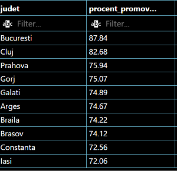


