#  Proiect Data Analysis

## Cuprins
- [Introducere](#introducere)
- [Cum funcționează?](#cum-funcționează)
  - [Primul Dashboard](#primul-dashboard)
  - [Al doilea Dashboard](#al-doilea-dashboard)
- [De ce am realizat acest proiect?](#de-ce-am-realizat-acest-proiect)
- [Codul SQL](#codul-sql)
  - [Creare baza de date si tabele](#creare-baza-de-date-și-tabele)
  - [Întrebări la care am răspuns](#întrebări-la-care-am-răspuns)
- [Excel](#excel)
- [Python](#python)
  
##  Introducere

  Acest proiect reprezintă un dashboard interactiv în Excel, care analizează rezultatele Evaluării Naționale din România din 2025. Acesta utilizează vizualizări dinamice pentru a explora performanța la nivel regional, distribuția notelor și rezultatele contestațiilor.

Proiectul evidențiază abilitățile mele de analiză a datelor și de utilizare a Excelului, folosind un set de date care conține peste 150.000 de înregistrări din cadrul Evaluării Naționale 2025. Pe parcursul proiectului, am calculat indicatori statistici descriptivi (media, mediana, quartilele și abaterea standard) pentru a analiza performanța elevilor și am prezentat rezultatele printr-o varietate de grafice interactive.

Ca abordare complementară, am utilizat și SQL pentru a calcula și analiza aceiași indicatori principali, validând astfel rezultatele obținute în Excel.

În urma realizării acestui proiect, inevitabil mi-am pus întrebarea „Dacă vreau să văd aceste statistici și pentru alți ani?”
În ultima secțiune a prezentării am inclus un cod scris în Python, prin intermediul căruia putem vizualiza informații referitoare la absenteism, promovabilitate, modificări survenite în urma contestațiilor și distribuția mediilor pe fiecare județ.


  Proiectul demonstrează, de asemenea, capacitatea mea de a:

- Crea liste derulante dinamice folosind validarea datelor;
- Construi și personaliza tabele Pivot și grafice Pivot;
- Conecta mai multe tabele Pivot la același slicer pentru filtrare sincronizată;
- Proiecta dashboard-uri interactive;
- Utiliza SQL;
- Utiliza Python.


##  Cum funcționează?
###  Primul Dashboard
  Selectează un județ din meniul drop-down.

  


###  Al doilea Dashboard
  Selectează o regiune din slicer.

  

##  De ce am realizat acest proiect?

Acesta este primul meu proiect de analiză a datelor și reprezintă o combinație între pasiunea mea pentru educație și interesul meu pentru domeniul data analytics. Având șase ani de experiență ca profesor de matematică, mi-am dorit să explorez modul în care datele educaționale pot fi analizate pentru a identifica tendințe, compara rezultate și răspunde unor întrebări relevante, dincolo de simpla prezentare a unor statistici.


Proiectul se focusează pe următoarele întrebări:
- **Este evaluarea cu adevărat obiectivă?**

   _Răspuns:_ Nu. 9% dintre participanții la examen au depus contestație, iar în 92% dintre cazuri media finală s-a modificat
  
  ```sql
  SELECT
    numar_contestatii *100/numar_elevi AS procent_contestatii,
    numar_modificari *100/numar_contestatii AS procent_modificari
  FROM (
    SELECT
        COUNT(rezultate_en.cod_unic_candidat) FILTER ( WHERE
            rezultate_en.contestatie_romana = 'DA' OR
            rezultate_en.contestatie_matematica = 'DA'
        ) AS numar_contestatii,
        COUNT(rezultate_en.cod_unic_candidat) AS numar_elevi,
        COUNT(rezultate_en.cod_unic_candidat) FILTER ( WHERE
            rezultate_en.nota_romana <> rezultate_en.nota_finala_romana
            OR
            rezultate_en.nota_matematica <> rezultate_en.NOTA_FINALA_MATEMATICA
        ) AS numar_modificari
    FROM
        rezultate_en
        LEFT JOIN
        counties ON
        rezultate_en.cod_judet = counties.county_code
    );
  ```


 Acest rezultat poate fi observat și în graficul de mai jos:

  
  
- **Poate un mediu social nefavorabil să contribuie la absenteismul și abandonul școlar?**
  
  _Răspuns:_ Da. Pe baza datelor înregistrate, în fiecare județ, cel mai mare număr de elevi absenți provine din mediul rural.

```sql
  SELECT
    numar_absenti *100/numar_elevi AS procent_absenti,
    absenti_rural *100/numar_absenti AS procent_rural
FROM (
    SELECT
        COUNT(rezultate_en.cod_unic_candidat) FILTER ( WHERE
            rezultate_en.STATUS_ROMANA = 'ABSENT' OR
            rezultate_en.STATUS_MATEMATICA = 'ABSENT'
        ) AS numar_absenti,
        COUNT(rezultate_en.cod_unic_candidat) AS numar_elevi,
        COUNT(rezultate_en.cod_unic_candidat) FILTER ( WHERE
            rezultate_en.MEDIU = 'RURAL' AND
            (rezultate_en.STATUS_ROMANA = 'ABSENT' OR
            rezultate_en.STATUS_MATEMATICA = 'ABSENT')
        ) AS absenti_rural
    FROM
        rezultate_en
        LEFT JOIN
        counties ON
        rezultate_en.cod_judet = counties.county_code
    );
```


  Acest rezultat este reflectat și în graficul și statisticile de mai jos.
  
  
  
- **Sunt notele școlare în concordanță cu rezultatele obținute la Evaluarea Națională?**
  
  _Răspuns:_ Nu. Datele analizate arată că media finală obținută pe parcursul anilor de școală este mai mare decât media obținută la examenul de Evaluare Națională.


 Următoarea secțiune evidențiază cele mai mari 10 diferențe identificate între cele două medii.

  ```sql
    SELECT
    elev,
    judet,
    medie_gimnaziu - medie_examen AS diferenta_medie
FROM (
    SELECT
        counties.county_name AS judet,
        rezultate_en.cod_unic_candidat AS elev,
        rezultate_en.media AS medie_examen,
        rezultate_en.MEDIA_GIMNAZIU AS medie_gimnaziu
    FROM
        rezultate_en 
        LEFT JOIN
        counties
        ON
        rezultate_en.cod_judet = counties.county_code
    WHERE
        rezultate_en.media IS NOT NULL
    
)
ORDER BY diferenta_medie DESC
LIMIT 10;
  ```


  
- **Există diferențe regionale semnificative în ceea ce privește rezultatele la evaluarea națională?**
  
  _Răspuns:_ Da. Graficul privind distribuția notelor pe județe, precum și graficul privind rata de promovabilitate pentru fiecare județ, evidențiază diferențe semnificative în ceea ce privește performanța școlară între județe.

  

  

  Top 10 județe privind rata de promovabilitate

  ```sql
    SELECT
    county_name,
    ROUND(nr_elevi_promovati*100.0/nr_elevi_inscrisi,2) AS procent_promovabilitate
    FROM (
    SELECT 
        counties.county_name,
        COUNT(rezultate_en.cod_unic_candidat) FILTER(
            WHERE rezultate_en.MEDIA >= 0
        ) AS nr_elevi_inscrisi,
        COUNT(rezultate_en.cod_unic_candidat) FILTER(
            WHERE
            rezultate_en.NOTA_FINALA_ROMANA >=5 AND
            rezultate_en.NOTA_FINALA_MATEMATICA >=5)
            AS nr_elevi_promovati
    FROM
        rezultate_en
        LEFT JOIN counties ON
            rezultate_en.cod_judet = counties.county_code
    GROUP BY 
        counties.county_name
    )
    ORDER BY procent_promovabilitate;
    LIMIT 10;
  ```


## Codul SQL
### Creare baza de date și tabele

```sql
  -- Creare baza de date

CREATE DATABASE en_2025;


/*Creare tabel rezultate_en care contine coloanele fisierului 
CSV importat in baza de date
*/

CREATE TABLE rezultate_en (
    COD_UNIC_CANDIDAT VARCHAR(10) PRIMARY KEY,
    SEX CHAR(1),
    MEDIU CHAR(5),
    COD_SIIIR VARCHAR(10),
    STATUS_ROMANA VARCHAR(7),
    STATUS_MATEMATICA VARCHAR(7),
    NOTA_ROMANA NUMERIC,
    NOTA_MATEMATICA NUMERIC,
    CONTESTATIE_ROMANA CHAR(2),
    NOTA_CONTESTATIE_ROMANA NUMERIC,
    CONTESTATIE_MATEMATICA CHAR(2),
    NOTA_CONTESTATIE_MATEMATICA NUMERIC,
    NOTA_FINALA_ROMANA NUMERIC,
    NOTA_FINALA_MATEMATICA NUMERIC,
    MEDIA NUMERIC,
    MEDIA_GIMNAZIU NUMERIC
);


/* Adaugare coloana judet in tabelul rezultate_en
Sa pot face ulterior JOIN cu tabelul counties
*/
ALTER TABLE rezultate_en
ADD COLUMN COD_JUDET VARCHAR(2);


/* Update tabel rezultate_en
Judetul de provenienta al elevului se regaseste in primele 2 caractere
ale codului SIIIR
*/
UPDATE rezultate_en
SET COD_JUDET = LEFT(COD_SIIIR,2);


/* Update coloana cod_siiir
Codul SIIIR este format din 10 caractere. Fisierul CSV nu ia in considerare 
primul caracter al sirului daca este 0.  
*/
UPDATE rezultate_en
SET cod_siiir =
    CASE
        WHEN LENGTH(cod_siiir)=9 THEN '0' || cod_siiir
        ELSE cod_siiir
    END;


-- Creare tabel counties, care contine numele judetului cu codul corespunzator

CREATE TABLE counties (
    county_code CHAR(2) PRIMARY KEY,
    county_name VARCHAR(30)
);

INSERT INTO counties(county_code,county_name)
VALUES
('01','Alba'),
('02','Arad'),
('03','Arges'),
('04','Bacau'),
('05','Bihor'),
('06','Bistrita-Nasaud'),
('07','Botosani'),
('08','Brasov'),
('09','Braila'),
('10','Buzau'),
('11','Caras-Severin'),
('12','Cluj'),
('13','Constanta'),
('14','Covasna'),
('15','Dambovita'),
('16','Dolj'),
('17','Galati'),
('18','Gorj'),
('19','Harghita'),
('20','Hunedoara'),
('21','Ialomita'),
('22','Iasi'),
('23','Ilfov'),
('24','Maramures'),
('25','Mehedinti'),
('26','Mures'),
('27','Neamt'),
('28','Olt'),
('29','Prahova'),
('30','Satu Mare'),
('31','Salaj'),
('32','Sibiu'),
('33','Suceava'),
('34','Teleorman'),
('35','Timis'),
('36','Tulcea'),
('37','Vaslui'),
('38','Valcea'),
('39','Vrancea'),
('40','Bucuresti'),
('51','Calarasi'),
('52','Giurgiu');


/* Legatura dintre tabelele rezultate_en si counties
Ii atribui fiecarui elev, judetul de unde provine
*/
SELECT *
FROM  rezultate_en LEFT JOIN
    counties ON rezultate_en.COD_JUDET = counties.county_code;
```

### Întrebări la care am răspuns

```sql
-- Evolutia mediilor pe judete, inainte si dupa contestatie 

SELECT 
    counties.county_name AS judet,
    ROUND(AVG(rezultate_en.NOTA_MATEMATICA),2) AS medie_matematica_inainte,
    ROUND(AVG(rezultate_en.NOTA_FINALA_MATEMATICA), 2) AS medie_matematica_dupa,
    ROUND(AVG(rezultate_en.nota_romana),2) AS medie_romana_inainte,
    ROUND(AVG(rezultate_en.nota_finala_romana), 2) AS medie_romana_dupa
FROM
    rezultate_en
    LEFT JOIN counties ON
        rezultate_en.cod_judet = counties.county_code
GROUP BY 
    counties.county_name
ORDER BY medie_matematica_inainte DESC;
```
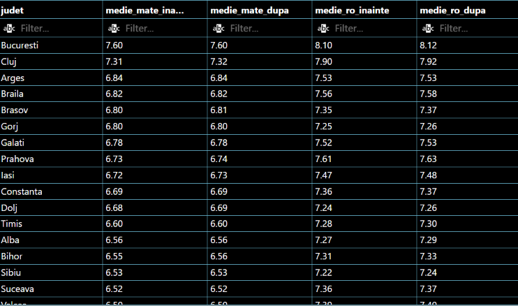

```sql
   SELECT
    county_name,
    ROUND(nr_elevi_promovati*100.0/nr_elevi_inscrisi,2) AS procent_promovabilitate
FROM (
    SELECT 
        counties.county_name,
        COUNT(rezultate_en.cod_unic_candidat) AS nr_elevi_inscrisi,
        COUNT(rezultate_en.cod_unic_candidat) FILTER(
            WHERE
            rezultate_en.STATUS_ROMANA = 'PREZENT' AND
            rezultate_en.STATUS_MATEMATICA = 'PREZENT')
            AS nr_elevi_prezenti,
        COUNT(rezultate_en.cod_unic_candidat) FILTER(
            WHERE
            rezultate_en.NOTA_FINALA_ROMANA >=5 AND
            rezultate_en.NOTA_FINALA_MATEMATICA >=5)
            AS nr_elevi_promovati
    FROM
        rezultate_en
        LEFT JOIN counties ON
            rezultate_en.cod_judet = counties.county_code
    GROUP BY 
        counties.county_name
)
ORDER BY procent_promovabilitate; 
```

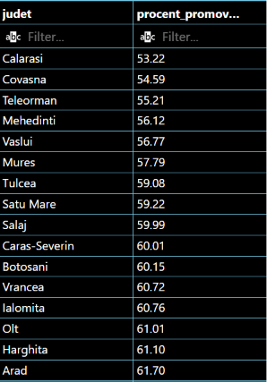

```sql
  -- Topul judetelor cu cea mai mare rata de absenteism

SELECT 
    county_name,
    ROUND(nr_elevi_absenti*100.0/nr_elevi_inscrisi,2) AS procent_absenti
FROM (
    SELECT 
            counties.county_name,
            COUNT(rezultate_en.cod_unic_candidat) AS nr_elevi_inscrisi,
            COUNT(rezultate_en.cod_unic_candidat) FILTER(
                WHERE
                rezultate_en.STATUS_ROMANA = 'ABSENT' OR 
                rezultate_en.STATUS_MATEMATICA = 'ABSENT')
                AS nr_elevi_absenti
        FROM
            rezultate_en
            LEFT JOIN counties ON
                rezultate_en.cod_judet = counties.county_code
        GROUP BY 
            counties.county_name
        ORDER BY
            nr_elevi_absenti
)
ORDER BY 
    procent_absenti DESC;
```
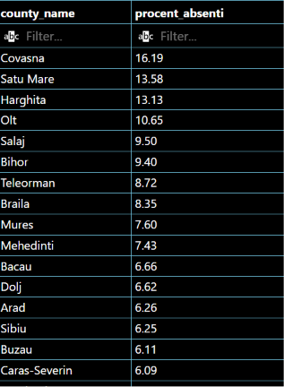

```sql
  -- Distributia mediilor pe judet

SELECT
    county_name,
    nr_prezenti,
    medii_sub_5,
    medii_intre_5_si_7,
    medii_intre_7_si_9,
    medii_intre_9_si_10,
    medii_de_10
FROM (
    SELECT 
        COUNT(rezultate_en.MEDIA) FILTER(
            WHERE
            rezultate_en.MEDIA IS NOT NULL)
            AS nr_prezenti,
        counties.county_name,
        COUNT(rezultate_en.MEDIA) AS nr_medii,
        COUNT(rezultate_en.MEDIA) FILTER(
            WHERE
            rezultate_en.MEDIA <5)
            AS medii_sub_5,
        COUNT(rezultate_en.MEDIA) FILTER(
            WHERE
            rezultate_en.MEDIA >=5 AND
            rezultate_en.MEDIA <7)
            AS medii_intre_5_si_7,
        COUNT(rezultate_en.MEDIA) FILTER(
            WHERE
            rezultate_en.MEDIA >=7 AND
            rezultate_en.MEDIA <9)
            AS medii_intre_7_si_9,
        COUNT(rezultate_en.MEDIA) FILTER(
            WHERE
            rezultate_en.MEDIA >=9 AND
            rezultate_en.MEDIA <10)
            AS medii_intre_9_si_10,
        COUNT(rezultate_en.MEDIA) FILTER(
            WHERE
            rezultate_en.MEDIA = 10.00)
            AS medii_de_10
    FROM
        rezultate_en
        LEFT JOIN counties ON
            rezultate_en.cod_judet = counties.county_code
    GROUP BY 
        counties.county_name
)
ORDER BY medii_sub_5 DESC;
```

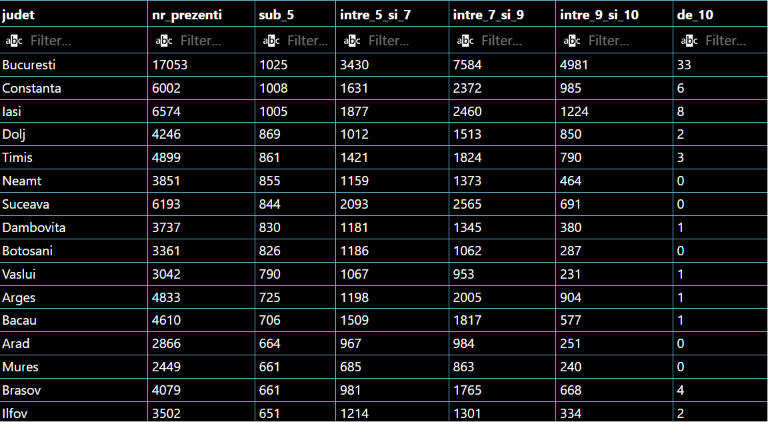

```sql
  -- Care este cea mai mare diferenta inregistrata intre media de dinainte si dupa contestatie? Unde a fost inregistrata?

    SELECT
        judet,
        nota_dupa_contestatie - nota_inainte_de_contestatie AS diferenta_punctaj
    FROM (


        SELECT 
            rezultate_en.cod_unic_candidat AS elev,
            counties.county_name AS judet,
            TRUNC((rezultate_en.NOTA_ROMANA + rezultate_en.NOTA_MATEMATICA)/2.00,2)
            AS nota_inainte_de_contestatie,
            rezultate_en.MEDIA AS nota_dupa_contestatie    
        FROM
            rezultate_en
        LEFT JOIN counties ON
            rezultate_en.cod_judet = counties.county_code
        WHERE
            rezultate_en.MEDIA IS NOT NULL AND
            rezultate_en.nota_romana IS NOT NULL AND
            rezultate_en.nota_matematica IS NOT NULL AND
            (rezultate_en.contestatie_romana = 'DA' OR
            rezultate_en.contestatie_matematica = 'DA')
    )
    ORDER BY diferenta_punctaj DESC
        LIMIT 1;
```

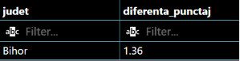

```sql
  -- Diferenta dintre media din gimnaziu si media la examen

SELECT
    judet,
    medie_gimnaziu - medie_examen AS diferenta_medie
FROM (
    SELECT
        counties.county_name AS judet,
        TRUNC(AVG(rezultate_en.media),2) AS medie_examen,
        TRUNC(AVG(rezultate_en.MEDIA_GIMNAZIU),2) AS medie_gimnaziu
    FROM
        rezultate_en 
        LEFT JOIN
        counties
        ON
        rezultate_en.cod_judet = counties.county_code
    WHERE
        rezultate_en.media IS NOT NULL
    GROUP BY
        judet
)
ORDER BY diferenta_medie DESC;
```

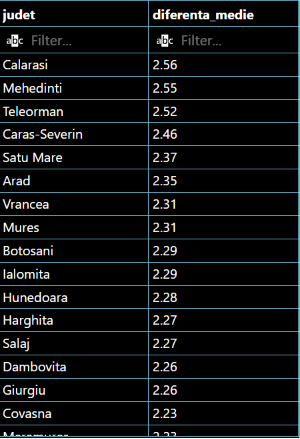

```sql
  /* Care sunt elevii unde s-a inregistrat cea mai mare diferenta dintre media din generala
si media din examen. De unde provin?*/

SELECT
    elev,
    judet,
    medie_gimnaziu - medie_examen AS diferenta_medie
FROM (
    SELECT
        counties.county_name AS judet,
        rezultate_en.cod_unic_candidat AS elev,
        rezultate_en.media AS medie_examen,
        rezultate_en.MEDIA_GIMNAZIU AS medie_gimnaziu
    FROM
        rezultate_en 
        LEFT JOIN
        counties
        ON
        rezultate_en.cod_judet = counties.county_code
    WHERE
        rezultate_en.media IS NOT NULL
    
)
ORDER BY diferenta_medie DESC
LIMIT 10;
```

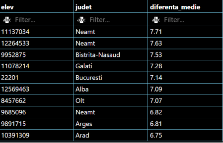

```sql
  --Cat % dintre elevi au depus contestatie? Cat % au avut media modificata?

SELECT
    numar_contestatii *100/numar_elevi AS procent_contestatii,
    numar_modificari *100/numar_contestatii AS procent_modificari
FROM (
    SELECT
        COUNT(rezultate_en.cod_unic_candidat) FILTER ( WHERE
            rezultate_en.contestatie_romana = 'DA' OR
            rezultate_en.contestatie_matematica = 'DA'
        ) AS numar_contestatii,
        COUNT(rezultate_en.cod_unic_candidat) AS numar_elevi,
        COUNT(rezultate_en.cod_unic_candidat) FILTER ( WHERE
            rezultate_en.nota_romana <> rezultate_en.nota_finala_romana
            OR
            rezultate_en.nota_matematica <> rezultate_en.NOTA_FINALA_MATEMATICA
        ) AS numar_modificari
    FROM
        rezultate_en
        LEFT JOIN
        counties ON
        rezultate_en.cod_judet = counties.county_code
    );
```

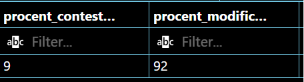

```sql
  -- Cat % dintre cei inscrisi au fost absenti? Cat % sunt din mediul rural?

SELECT
    numar_absenti *100/numar_elevi AS procent_absenti,
    absenti_rural *100/numar_absenti AS procent_rural
FROM (
    SELECT
        COUNT(rezultate_en.cod_unic_candidat) FILTER ( WHERE
            rezultate_en.STATUS_ROMANA = 'ABSENT' OR
            rezultate_en.STATUS_MATEMATICA = 'ABSENT'
        ) AS numar_absenti,
        COUNT(rezultate_en.cod_unic_candidat) AS numar_elevi,
        COUNT(rezultate_en.cod_unic_candidat) FILTER ( WHERE
            rezultate_en.MEDIU = 'RURAL' AND
            (rezultate_en.STATUS_ROMANA = 'ABSENT' OR
            rezultate_en.STATUS_MATEMATICA = 'ABSENT')
        ) AS absenti_rural
    FROM
        rezultate_en
        LEFT JOIN
        counties ON
        rezultate_en.cod_judet = counties.county_code
    );
```
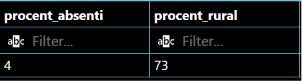

## Excel

Foaia _export_ de la care am pornit proiectul conține următoarele coloane
- COD UNIC CANDIDAT, tip TEXT;
- SEX, tip TEXT (M/F);
- MEDIU, tip TEXT (URBAN/RURAL;
- COD SIIIR , tip TEXT;
- STATUS ROMANA, tip TEXT (ABSENT/PREZENT);
- STATUS MATEMATICA, tip TEXT (ABSENT/PREZENT);
- NOTA ROMANA, tip NUMBER;
- NOTA MATEMATICA, tip NUMBER;
- CONTESTATIE ROMANA, tip TEXT (DA/NU);
- NOTA CONTESTATIE ROMANA, tip NUMBER;
- CONTESTATIE MATEMATICA, tip TEXT (DA/NU);
- NOTA CONTESTATIE MATEMATICA, tip NUMBER;
- NOTA FINALA ROMANA, tip NUMBER;
- NOTA FINALA MATEMATICA, tip NUMBER;
- MEDIA, tip NUMBER;
- MEDIA V-VIII, tip NUMBER.

În foaia _situatie_regiuni_ am calculat media înainte de contestație,

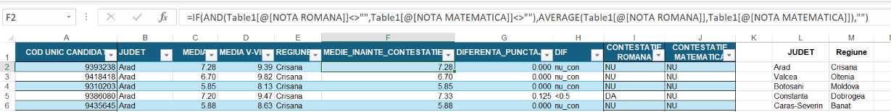

diferența punctajului dintre nota înainte de contestație și după contestație,

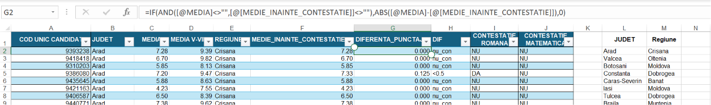

am adăugat fiecărui elev câte o etichetă privind diferența calculată anterior astfel:
- dacă nu au contestat, eticheta „nu_con”;
- dacă au contestat, dar nu s-a modificat media, eticheta „nu_mod”;
- dacă diferența calculată era <0.5 puncte, eticheta „<0.5”;
- dacă diferența calculată era >=0.5 și <1, eticheta „<1”;
- dacă diferența calculată era >=1 și <2, eticheta „<2”;
- dacă diferența calculată era de peste 2 puncte, eticheta „>2”,

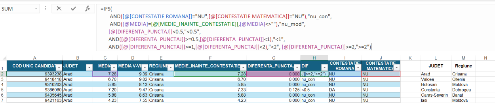

am adăugat fiecărui elev regiunea de unde acesta este.

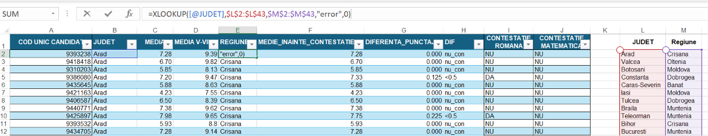

În foaia _%promovati_ am extras primele două caractere din codul SIIIR,

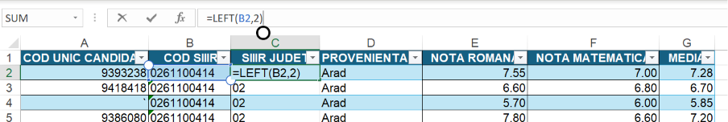

am atribuit fiecărui elev județul de proveniență

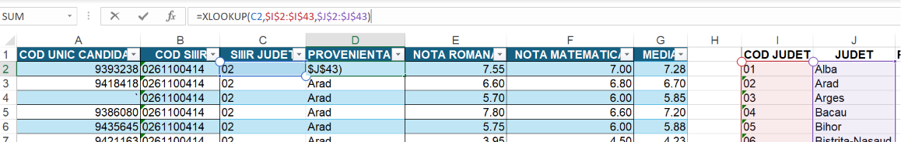

am calculat procentul de promovabilitate pentru fiecare județ, atât la matematica, la română cât și pentru media finală.

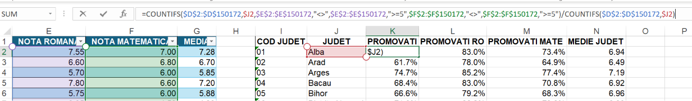

În foaia _statistica_ am calulat pentru fiecare județ
- numărul elevilor, **NR ELEVI**;
- cea mai mică medie, **MINIM**;
- prima quartilă, **Q1**;
- mediana, **MEDIANA**;
- media, **MEDIA**;
- a treia quartilă, **Q3**;
- cea mai mare medie, **MAXIM**;
- deviația standard, **DEVIATIA STANDARD**;
- numărul mediilor mai mici decât 5, **<5**;
- numărul mediilor între 5 și 7, **5<=x<7**;
- numărul mediilor între 7 și 9, **7<=x<9**;
- numărul mediilor între 9 și 10 inclusiv, **9<=x<=10**.

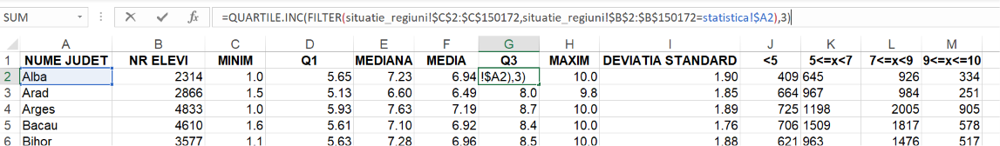


În foaia _absenteism_ am calculat procentul de absenți pentru fiecare județ, procentul de absenți care provin din mediul rural și procentul de absenți din mediul rural de sex masculin.

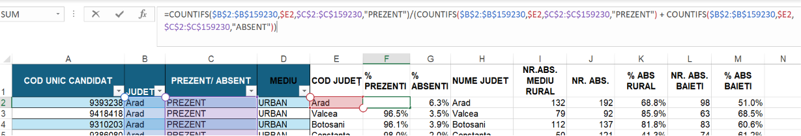

Am creat următoarele Pivot Tables ale căror Pivot Charts respective le-am folosit în al doilea Dashboard.


Care arată pentru fiecare regiune/județ diferența punctajelor dintre medii înainte și după contestații.


Care afișează pentru fiecare regiune/județ media mediilor de la Evaluarea Națională și media mediilor din gimnaziu.


Care arată pentru fiecare regiune/județ media mediilor la Evaluarea Națională înainte și după contestații.

Fiecare Pivot Table, respectiv Pivot Chart este conectat la un slicer comun care ajută la navigarea pe al foilea Dashboard.

## Python

Pentru realizarea acestei secțiuni a proiectului am utilizat __PostreSQL__, un sistem de management al bazelor de date relaționale, pentru stocarea și gestionarea datelor. Codul Python a fost scris și rulat în __Visual Studio Code__. Fișierele Excel utilizate au fost preluate de pe __https://data.gov.ro/__. Toate fișierele utilizate au aceeași structură, respectând același format, ceea ce a permis procesarea și analiza lor într-un mod unitar.
Pentru această secțiune, toate exemplele prezentate utilizează date aferente anului 2025 județul Constanța, pentru a păstra coerența și unitatea cu restul proiectului.

Bibliotecile Python utilizate

```python
# importuri

import pandas as pd
import numpy as np
import matplotlib.pyplot as plt

```

Funcția folosită pentru crearea dataframe-ului, curățarea datelor, modificarea - ștergerea - adăgarea coloanelor

```python
# creare dataframe

def dataFrame (an):
    # citirea fisierului
    df = pd.read_excel(f'fisiere\en{an}.xlsx')
    # cleaning
    df.columns = df.columns.str.strip()
    df['COD UNIC CANDIDAT'] = df['COD UNIC CANDIDAT'].astype(str)
    df['COD SIIIR'] = df['COD SIIIR'].astype(str)
    df['COD SIIIR'] = df['COD SIIIR'].apply(lambda x: '0' + x if len(x) == 9 else x)
    df = df[~df['STATUS LIMBA MATERNA'].isin(['PREZENT','ABSENT'])]
    df = df.drop(columns=['STATUS LIMBA MATERNA', 'NOTA LIMBA MATERNA','CONTESTATIE LIMBA MATERNA','NOTA CONTESTATIE LB MATERNA','NOTA FINALA LB MATERNA'])
    # creare coloane noi
    df['COD JUDET'] = df['COD SIIIR'].str[:2] 
    df['MEDIE INAINTE'] = np.floor(np.round(((df['NOTA ROMANA'] + df['NOTA MATEMATICA'])/2),10)*100)/100
    # dictionar cod judet: nume judet
    dict_judet = {
    '01':'Alba',
    '02':'Arad',
    '03':'Arges',
    '04':'Bacau',
    '05':'Bihor',
    '06':'Bistrita Nasaud',
    '07':'Botosani',
    '08':'Brasov',
    '09':'Braila',
    '10':'Buzau',
    '11':'Caras Severin',
    '12':'Cluj',
    '13':'Constanta',
    '14':'Covasna',
    '15':'Dambovita',
    '16':'Dolj',
    '17':'Galati',
    '18':'Gorj',
    '19':'Harghita',
    '20':'Hunedoara',
    '21':'Ialomita',
    '22':'Iasi',
    '23':'Ilfov',
    '24':'Maramures',
    '25':'Mehedinti',
    '26':'Mures',
    '27':'Neamt',
    '28':'Olt',
    '29':'Prahova',
    '30':'Satu Mare',
    '31':'Salaj',
    '32':'Sibiu',
    '33':'Suceava',
    '34':'Teleorman',
    '35':'Timis',
    '36':'Tulcea',
    '37':'Vaslui',
    '38':'Valcea',
    '39':'Vrancea',
    '40':'Bucuresti',
    '51':'Calarasi',
    '52':'Giurgiu'
}
    df['NUME JUDET'] = df['COD JUDET'].map(dict_judet)
    return df

```

Funcția pentru afișarea topului județelor privind rata absenteismului.
Dacă județul ales nu se află în top 10 atunci funcția va afișa poziția județului în clasament

```python

# top absenti

def topAbsenti(dataframe):
    nr_inscrisi = dataframe['NUME JUDET'].value_counts()
    elevi_absenti = dataframe[(dataframe['STATUS ROMANA'] == 'ABSENT') | (dataframe['STATUS MATEMATICA'] == 'ABSENT')]
    nr_absenti = elevi_absenti['NUME JUDET'].value_counts()
    absenteism = (nr_absenti*100)/nr_inscrisi
    lista_judete = absenteism.round(2).sort_values(ascending=False)
    pozitie = lista_judete.index.get_loc(judet) + 1
    if pozitie != 1:
        print(f'Judetul {judet} se afla pe locul al {pozitie}-lea in clasament')
    else: print(f'Judetul {judet} se afla pe primul loc in clasament')
    absenteism = absenteism.round(2).sort_values().tail(10)
    fig, ax = plt.subplots()
    grafic = ax.barh(absenteism.index,absenteism.values, color='#1E3A8A')
    ax.set_title(f'Top 10 judete privind rata absenteismului la EN {an}')
    ax.xaxis.set_visible(False)
    ax.spines[['right','top','bottom']].set_visible(False)
    ax.bar_label(grafic, padding=-45, color='white',fmt='%.2f%%', fontweight='bold')
    plt.show()
    return fig

```

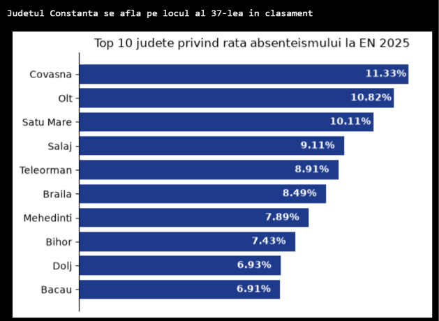


Funcția pentru afișarea topului județelor privind rata promovabilității.
Dacă județul ales nu se află în top 10 atunci funcția afișează poziția județului în clasament

```python
# top promovabilitate

def topPromovabilitate(dataframe):
    df = dataframe[dataframe['MEDIA'].notna()]
    df2 = df[(df['NOTA FINALA ROMANA'] >= 5) & (df['NOTA FINALA MATEMATICA'] >=5)]
    nr_participanti = df['NUME JUDET'].value_counts()
    nr_promovati = df2['NUME JUDET'].value_counts()
    promovabilitate = (nr_promovati * 100) / nr_participanti
    lista_judete = promovabilitate.round(2).sort_values(ascending=False)
    pozitie = lista_judete.index.get_loc(judet) + 1
    if pozitie != 1:
        print(f'Judetul {judet} se afla pe locul al {pozitie}-lea in clasament')
    else: print(f'Judetul {judet} se afla pe primul loc in clasament')
    promovabilitate = promovabilitate.round(2).sort_values().tail(10)
    fig, ax = plt.subplots()
    grafic = ax.barh(promovabilitate.index,promovabilitate.values, color='#1E3A8A')
    ax.set_title(f'Top 10 judete privind rata promovabilitatii la EN {an}')
    ax.xaxis.set_visible(False)
    ax.spines[['right','top','bottom']].set_visible(False)
    ax.bar_label(grafic, padding=-45, color='white',fmt='%.2f%%', fontweight='bold')
    plt.show()
    return fig

```

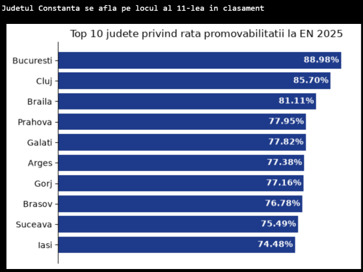

Funcția care afișează distribuția mediilor pe județ.

```python
# distributia mediilor pe judet

def distributiaMediilor(dataframe, judet):
    df = dataframe[(dataframe['NUME JUDET'] == judet) & (dataframe['MEDIA']>=0)]
    nr_prezenti = df['COD UNIC CANDIDAT'].count()
    sub5 = (df[df['MEDIA']<5]['COD UNIC CANDIDAT'].count()*100/nr_prezenti).round(2)
    intre5_si7 = (df[(df['MEDIA']>=5) & (df['MEDIA']<7)]['COD UNIC CANDIDAT'].count()*100/nr_prezenti).round(2)
    intre7_si9 = (df[(df['MEDIA']>=7) & (df['MEDIA']<9)]['COD UNIC CANDIDAT'].count()*100/nr_prezenti).round(2)
    intre9_si10_inclusiv = (df[(df['MEDIA']>=9) & (df['MEDIA']<=10)]['COD UNIC CANDIDAT'].count()*100/nr_prezenti).round(2)
    fig, ax = plt.subplots()
    ax.pie([sub5, intre5_si7, intre7_si9, intre9_si10_inclusiv],
            colors=['#e74c3c', '#f39c12', '#f1c40f', '#2ecc71'],
            autopct='%.2f%%',
            textprops={'color': 'white', 'fontweight':'bold'}
            )
    ax.legend(['medii sub 5', 'medii intre 5 si 7', 'medii intre 7 si 9', 'medii peste sau egale cu 9'],
              loc='center left',
              bbox_to_anchor = (1, 0.5))
    ax.set_title(f'Distributia mediilor la EN {an} in judetul {judet}\n' f'Numar prezenti: {nr_prezenti}')
    return fig

```

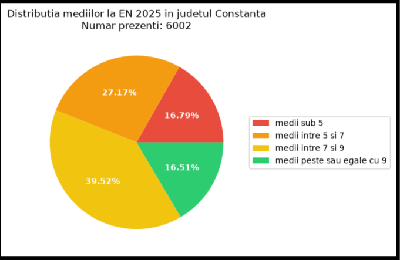

Funcția care afișează cum s-au modificat mediile elevilor după contestație.

```python

# mdoficari in urma contestatiilor

def modificariContestatii(dataframe, judet):
    df = dataframe[(dataframe['MEDIA']>=0) & (dataframe['NUME JUDET'] == judet)]
    nr_prezenti = df['COD UNIC CANDIDAT'].count()
    df2 = df[(df['CONTESTATIE ROMANA'] == 'DA') | (df['CONTESTATIE MATEMATICA'] == 'DA')]
    nr_contestatii = df2['COD UNIC CANDIDAT'].count()
    df2['DIFERENTA MEDIE'] = abs(df2['MEDIA'] - df2['MEDIE INAINTE'])
    nu_mod, dif_mica, dif_medie, dif_mare = 0, 0, 0, 0
    for each in df2['DIFERENTA MEDIE']:
        if each == 0:
            nu_mod +=1
        if each >0 and each <=0.50:
            dif_mica +=1
        if each > 0.50 and each <= 1:
            dif_medie +=1
        if each > 1:
            dif_mare +=1
    mod = nr_contestatii - nu_mod
    fig, ax = plt.subplots()
    grafic = ax.bar(['nr medii\n nemodificate', 'diferenta\n sub 0.5p', 'diferenta intre\n 0.5p si 1p ', 'diferenta\n peste 1p'], [nu_mod,dif_mica, dif_medie, dif_mare], color='#1E3A8A')
    ax.set_title(f'Modificarile in urma contestatiilor la EN {an} in judetul {judet}\n' f'Numar contestatii inregistrate: {nr_contestatii}')
    ax.yaxis.set_visible(False)
    ax.bar_label(grafic, fontweight='bold', color='black' )
    ax.spines[['top', 'right', 'left']].set_visible(False)
    return fig

```

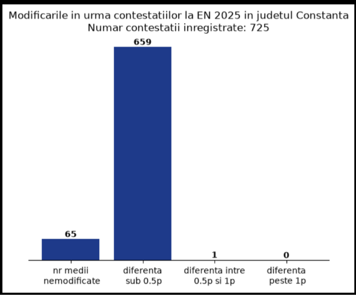

Funcția care afișează o histogramă cu distribuția mediilor pe județ și indicatorii statistici: media, mediana și quartilele 1 respectiv 3.

```python

# indicatori statistici

def indicatoriStatistica(dataframe, judet):
    df = dataframe[(dataframe['NUME JUDET'] == judet) & (dataframe['MEDIA'] >= 0)]
    media = df['MEDIA'].mean()
    mediana = df['MEDIA'].median()
    q1 = df['MEDIA'].quantile(0.25)
    q3 = df['MEDIA'].quantile(0.75)
    xbins = np.arange(1,12,1)
    fig, ax = plt.subplots()
    ax.hist(df['MEDIA'], bins=xbins, color='#1E3A8A')
    ax.axvline(media, linestyle='--', color='red', label=f'Media: {media: .2f}', linewidth=3)
    ax.axvline(mediana, linestyle='--', color='green', label=f'Mediana: {mediana: .2f}', linewidth=3)
    ax.axvline(q1, linestyle='--', color='black', label=f'Q1: {q1: .2f}', linewidth=3)
    ax.axvline(q3, linestyle='--', color='black', label=f'Q3:{q3: .2f}', linewidth=3)
    ax.set_xticks(range(1,11))
    ax.spines[['left','right','top']].set_visible(False)
    ax.set_title(f'Distributia mediilor la EN{an} pentru judetul {judet}')
    ax.legend(loc='center left', bbox_to_anchor = (1, 0.75))

    return fig

```

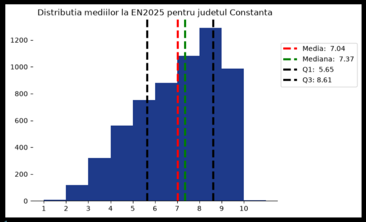

