# Project Data Analysis
Interactive Excel dashboard analyzing Romania's 2025 National Evaluation results. The project uses dynamic visualizations to explore regional performance, grade distributions, and contestation outcomes.

_export_, the dataset used as the starting point for this project, contains the following columns:
- COD UNIC CANDIDAT, type General, unique identifier assigned to each candidate;
- SEX, type General, candidate's gender (F or M) ;
- MEDIU, type General, candidate's area of residence (URBAN or RURAL) ;
- COD SIIIR, type General, unique code identifying the educational institution attended by the candidate;
- STATUS ROMANA, type General, indicates whether the candidate was present or absent at the Romanian language exam (PREZENT or ABSENT) ;
- STATUS LIMBA MATERNA, type General, candidate's attendace status at the Mother tongue exam (PREZENT or ABSENT) ;
- STATUS MATEMATICA, type General, candidate's attendace status at the Mathematics exam (PREZENT or ABSENT) ;
- NOTA ROMANA, type Number, grade obtained in the Romanian language exam;
- NOTA LIMBA MATERNA, type Number, grade obtained in the Mother tongue exam;
- NOTA MATEMATICA, type Number, grade obtained in the Mathematics exam;
- CONTESTATIE ROMANA, type General, indicates whether the candidate submited an appeal for the Romanian language exam (DA or NU) ;
- NOTA CONTESTATIE ROMANA, type Number, final grade obtained in the Romanian language exam after appeals;
- CONTESTATIE LIMBA MATERNA, type General, indicates whether the candidate submited an appeal for the Mother language exam (DA or NU) ;
- NOTA CONTESTATIE LB MATERNA, type Number, final grade obtined in the Mother language exam after appeal;
- CONTESTATIE MATEMATICA, type General, indicates whether the candidate submited an appeal for the Mathematics exam (DA or NU) ;
- NOTA CONTESTATIE MATEMATICA, type Number, final grade obtined in the Mathematics exam after appeal;
- NOTA FINALA ROMANA, type Number, final grade in the Romanian language exam;
- NOTA FINALA LB MATERNA, type Number, final grade in the Mother language exam;
- NOTA FINALA MATEMATICA, type Number, final grade in the Mathematics exam;
- MEDIA, type Number, final average grade obtined in the National Evaluation examination;
- MEDIA V-VIII, type Number, average grade obtined during grades V - VIII.

The next step was to create the _%promovati_ worksheet, containing the following column:
- COD UNIC CANDIDAT;
- COD SIIIR;
- SIIIR JUDET, type General, in which i extracted the first two characters of the COD SIIIR to identify the student's county of origin;
  
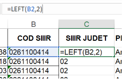

- COD JUDET, type Text, the two-digit SIIIR county code corresponding to each county;
- JUDET, type Text, the name of each county in Romania;
- PROVENIENTA, type General, in which by using the _XLOOKUP_ functian, i assigned each student to the corresponding county based on the SIIIR county code;

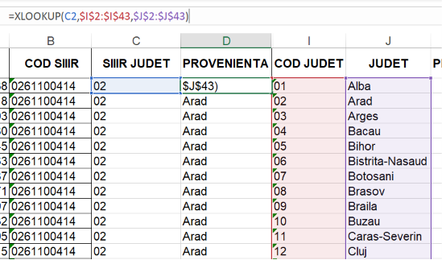

- NOTA FINALA ROMANA;
- NOTA FINALA MATEMATICA;
- MEDIA;
- PROMOVATI RO, type Percentage, in which i calculated the percentage of students who passed the Romanian language exam for each county;
- PROMOVATI MATE, type Percentage, in which i calculated the percentage of students who passed the Mathematics exam for each county;
- PROMOVATI, type Percentage, which represents the percentage of students who passed both exams in each county;

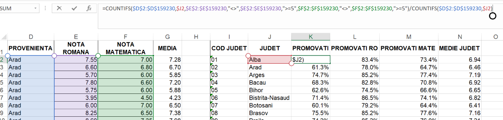

Based on the JUDET and PROMOVATI columns, i created a Map Chart that displays the pass rate for each county.

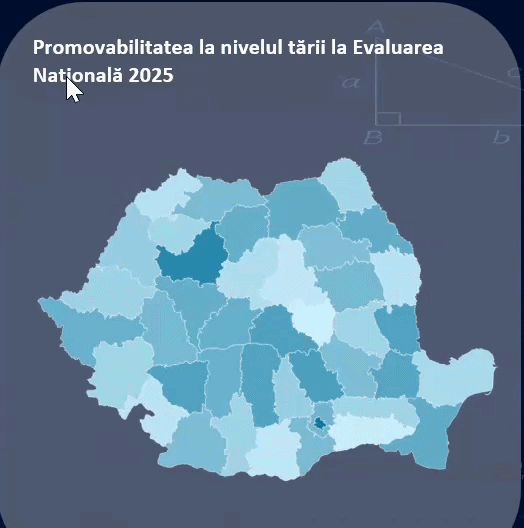

The next step in my project was to create a new worksheet named _situatie_regiuni_, where i calculated, in the DIFERENTA_PUNCTAJ column, the difference between each student's average grade before and after the appeals process. Based on this differece, i assigned a label to each student in the  DIF column.

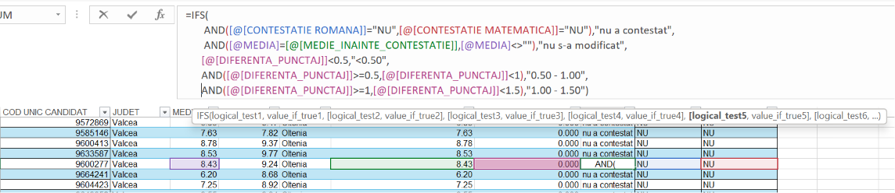

Then i assigned each student to the region in which their county of residence is located. 

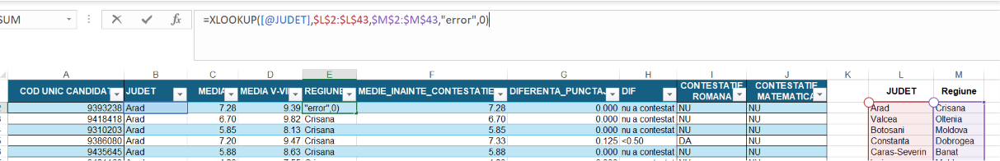

Later, based on the region, i created a slicer for the PivotTable. The corresponding PivotChart shows how many students submitted appeals and how their grades changed after the appeals process, allowing the results to be filtered by region.

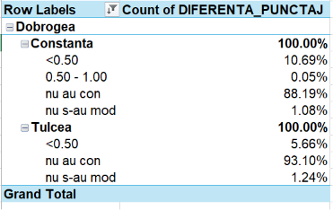

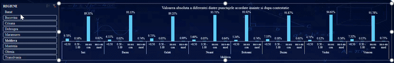

Additionally, i created two more PivotTables with their corresponding PivotCharts. These visualisations show the evolution of the average grade after appeals

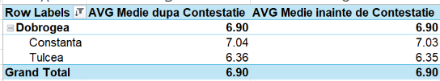

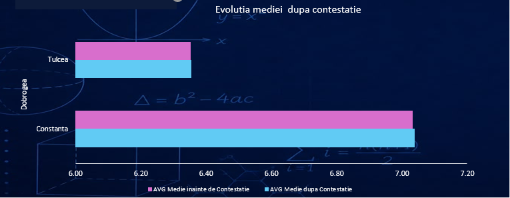

and the difference between the final exam grade and the average grade achived during Grades V - VIII, also allowing the results to be filtered by region.

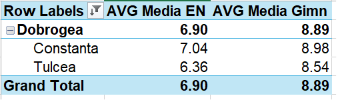

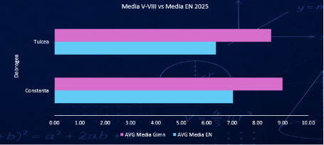

The _statistica_ worksheet contains descriptive statistics calculated for each Romanian county. For every county, the following indicators were computed:
- Average (Mean) ;
- Median;
- First Quartile (Q1) ;
- Third Quartile (Q3) ;
- Standard deviation;
- Total number of students.

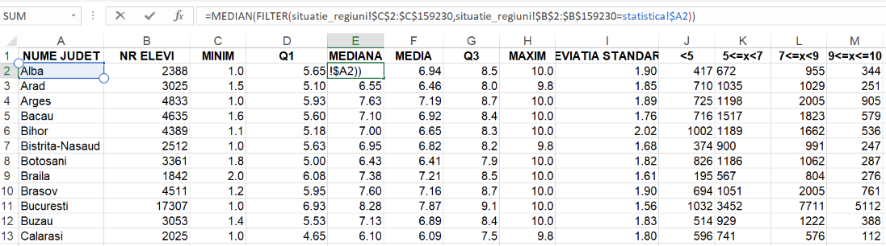

In addition, the students were grouped into grade intervals to analyze the distribution of final results:
- below 5.00;
- between 5.00 and 6.99;
- between 7.00 and 8.99;
- between 9.00 and 10.00 (inclusive)

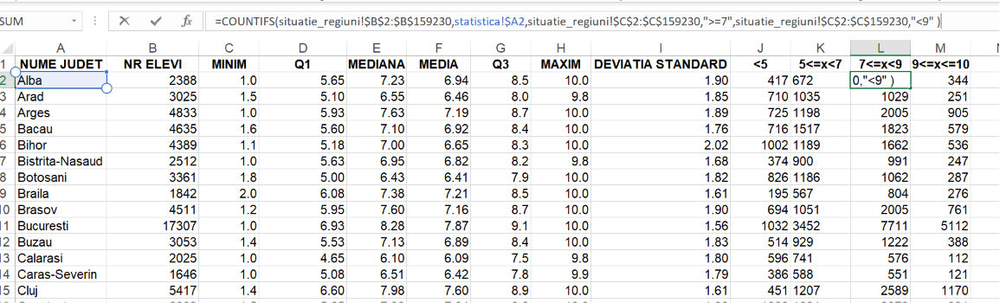

These statistics provide a comprehensive overview of student performance across counties and facilitate comparisons of grade distribution and overall achievement levels.

I created a Data Visualisation drop-down list that allows the user to select a county. Based on the selected county, the dashboard automatically updates and displays the corresponding statistics, including a _Box & Whisker chart_ and a _Histogram chart_ showing the distribution of students'final grades.

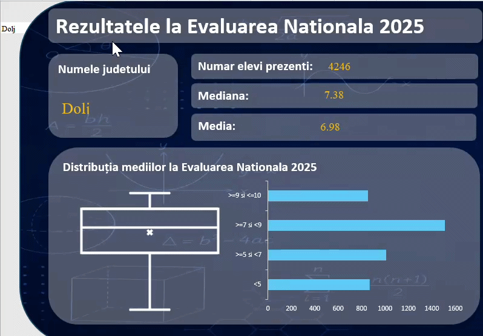

The _absenteism_ worksheet contains statisitcs for each county regarding the percentage of students who were absent from the national examination. It also includes a breakdown of absent students by area of residence (urban and rural) and by gender (male and female).

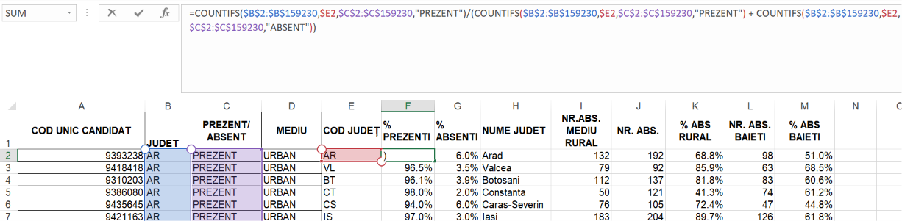

A _doughnut chart_ was created to visualize these distributions, and it is linked to the same Data Validation drop-down list described earlier, allowing the chart to update dynamically based on the selected county.

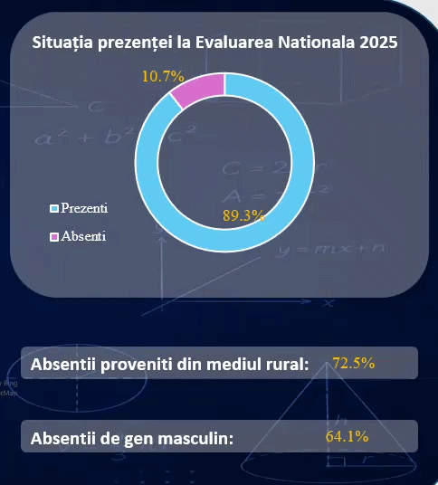
